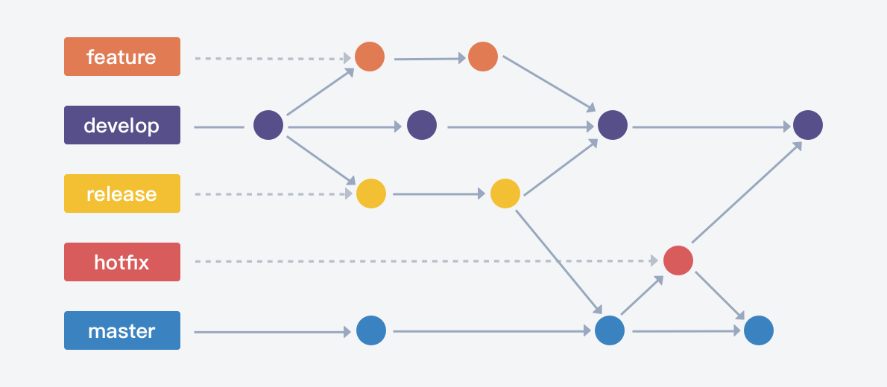

[TOC]

#  四种 Git 代码管理工作流简介

请先设置适用的 Git 工作流（分支拉取、合入等约束规则）。 CODING 为您推荐了业界常见的 4 种 Git 工作流，您可以选择任一预设的工作流作为初始配置，也可以选择自定义配置，全新定义团队需要的分支规则。

## 一、Github Flow 模式

GitHub Flow 是一个非常轻便的，基于分支的工作流，非常适合代码部署非常频繁的团队和项目。它最大优点就是简单，对于"持续发布"的产品是最合适的流程。
它默认 master 的更新与产品的发布是一致的。

### 版本管理

默认开启版本管理。开启后，拉取的分支将归属于版本，包括分支关联的需求、缺陷等数据也将从该版本关联的维度去筛选过滤。

### 分支类型

1. 默认 master 为主干分支。
2. 自定义 2 种分支类型。

开发分支，分支名 `dev/*`，跟随版本。
修复分支，分支名 `bugfix/*`，跟随版本。

### 分支拉取与合入规则

1. 允许从所有类型拉取 `dev`，并自动同步源分支。

2. 允许从所有类型拉取 `bugfix `
3. 允许`dev`合并至`dev`、 `master`
4. 允许bugfix合并至`bugfix`、 `master`

### 高级工具支持

1. 默认开启分支权限管理。
2. 默认开启分支变更文件覆盖提醒及自动同步。

### 需求、缺陷绑定设置

若项目关联 TAPD 项目，则开发分支需要绑定 TAPD 需求，补丁分支需要绑定 TAPD 缺陷。

## 二、Gitlab Flow 版本发布

GitLab Flow版本发布工作流适用于有明确的版本规划、并且需要支持多个版本的项目，比如PC、终端类产品。
在该工作流中，存在一个主分支 `master`，作为集成分支，每一个发布版本将从master拉出一个发布分支。发布分支只做bugfix，不再合入需求特性。

GitLab Flow 提倡"上游优先"（upstream first）的缺陷修复原则，即bugfix先提交到主分支master，再从master cherry-pick到目标发布分支。

### 版本管理

默认开启版本管理。开启后，拉取的分支将归属于版本，包括分支关联的需求、缺陷等数据也将从该版本关联的维度去筛选过滤。

### 分支类型

1. 默认 master 为主干分支。
2. 自定义 3 种分支类型。

发布分支，分支名 `release/*`。
开发分支，分支名 `dev/*`，跟随版本。
修复分支，分支名 `bugfix/*`，跟随版本。

### 分支拉取与合入规则

1. 允许从所有类型拉取`dev`，并自动同步源分支。
2. 允许从所有类型拉取`release`，并自动同步源分支。
3. 允许从所有类型拉取`bugfix`，并自动同步源分支。
4. 允许 `dev` 合并至`dev` `master`
5. 允许release合并至`release` `master`
6. 允许bugfix合并至`master` `release` `bugfix`

### 高级工具支持

1. 默认开启分支权限管理。
2. 默认开启分支变更文件覆盖提醒及自动同步。

### 需求、缺陷绑定设置

若项目关联 TAPD 项目，则开发分支需要绑定 TAPD 需求，补丁分支需要绑定 TAPD 缺陷。

## 三、Gitlab Flow 持续发布

GitLab Flow持续发布工作流一般适用于前端、后台持续/频繁发布的项目，关注最新版本，无需维护多个历史版本。
在该工作流中，存在一个主分支 master，作为集成分支，并存在pre-production、production分支分别对应预发布环境和生产环境。
GitLab Flow提倡"上游优先"（upstream first）原则，代码更新先提交到主分支master，再由"上游"向"下游"发展，逐步合入到pre-production和production。

### 版本管理

默认开启版本管理。开启后，拉取的分支将归属于版本，包括分支关联的需求、缺陷等数据也将从该版本关联的维度去筛选过滤。

### 分支类型

1. 默认 `master` 为主干分支。
2. 自定义 `4` 种分支类型。

发布分支，分支名 `production/*`。
预发布分支，分支名 `pre-production/*`。
bugfix分支，分支名 `bugfix/*`，跟随版本。
开发分支，分支名 `dev/*`，跟随版本。

### 分支拉取与合入规则

1. 允许从所有类型拉取`dev`，并自动同步源分支。
2. 允许从所有类型拉取`bugfix`，并自动同步源分支。
3. 允许 `dev` 合并至`dev` `master`
4. 允许 `master` 合并至`pre-production`
5. 允许`pre-production`合并至`production`
6. 允许`bugfix`合并至`master` `dev` `pre-production` `production`

### 高级工具支持

1. 默认开启分支权限管理。
2. 默认开启分支变更文件覆盖提醒及自动同步。

### 需求、缺陷绑定设置

若项目关联 TAPD 项目，则开发分支需要绑定 TAPD 需求，补丁分支需要绑定 TAPD 缺陷。

## 四、Git Flow 
Git Flow 定义了一个围绕项目发布的严格分支模型，相对复杂，但它提供了一个健壮的用于管理大型项目的框架，非常适用于管理大型项目的发布和维护。
它通过为功能开发、发布准备和项目维护分配独立的分支，让发布迭代过程更流畅。此模式通常是基于"版本发布"的，目标是一段时间以后产出一个新版本。

### 版本管理

默认开启版本管理，按版本管理多个代码库分支的研发协作流程。

### 分支类型

1. 新增 develop 分支，并设置为主干分支。
2. 自定义 4 种分支类型。

稳定分支，并设置 `master` 为稳定分支(稳定指分支上的每个节点都是稳定的可发布到线上的)。
发布分支，分支名 `release/*`，跟随版本(用来做预发的分支。最终的发布，要合到`master`上发布)。
开发分支，分支名 `feature/*`，跟随版本。
补丁分支，分支名 `hotfix/*`，跟随版本。

### 分支拉取与合入规则

1. 允许从所有类型拉取`feature`，并自动同步源分支。
2. 允许从所有类型拉取`release`
3. 允许从所有类型拉取`hotfix`
4. 允许feature合并至`develop` `feature`
5. 允许`master` `develop` `release`合并至`release`
6. 允许`hotfix`合并至`master` `develop` `release` `hotfix`

### 高级工具支持

1. 默认开启分支权限管理。
2. 默认开启分支变更文件覆盖提醒及自动同步。

### 需求、缺陷绑定设置

若项目关联 TAPD 项目，则开发分支需要绑定 TAPD 需求，补丁分支需要绑定 TAPD 缺陷。