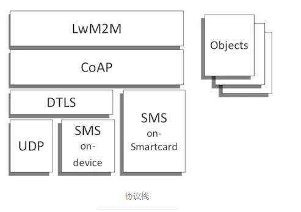

# LWM2M协议简介
LwM2M是一套适用于物联网的协议，全称是Lightweight Machine-To-Machine。
1）这个协议是轻量级的；2）这个协议适用于物联网设备。

<table>
    <tr>
        <td colspan="2">LWM2M(Lightweight Machine-To-Machine)</td>
    </tr>
    <tr>
        <td colspan="2">CoAP</td>
    </tr>
    <tr>
        <td>DTLS</td><td>SMS</td>
    </tr>
    <tr>
        <td>UDP</td><td>&nbsp;</td>
    </tr>
</table>

[LWM2M特点](https://www.jianshu.com/p/11d34008f486)
- 协议基于REST架构。
- 协议的消息传递是通过CoAP协议来达成的。
- 协议定义了一个紧凑高效又不乏扩展性的数据模型。
  

出于类似的考虑，协议的数据结构必须足够简单。LwM2M协议定义了一个以资源（Resource）为基本单位的模型，每个资源可以携带数值，可以指向地址，以表示LwM2M客户端中每一项可用的信息。资源都存在于对象实例中（Object Instance），即对象（Object）的实例化。LwM2M协议预定义了8种对象（Object）来满足基本的需求，分别是：

|Object	|Object ID|
|:-----|:-----|
|Security（安全对象）|	0|
|Server（服务器对象）|	1|
|Access Control（访问控制对象）|	2|
|Device（设备对象）|	3|
|Connectivity Monitoring（连通性监控对象）|	4|
|Firmware（固件对象）|	5|
|Location（位置对象）|	6|
|Connectivity Statistics（连通性统计对象）|	7 |
